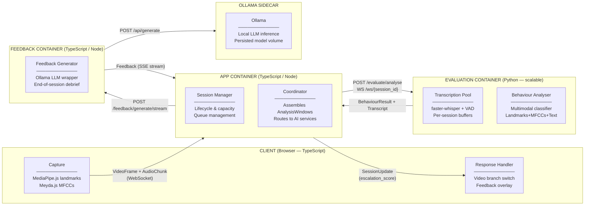
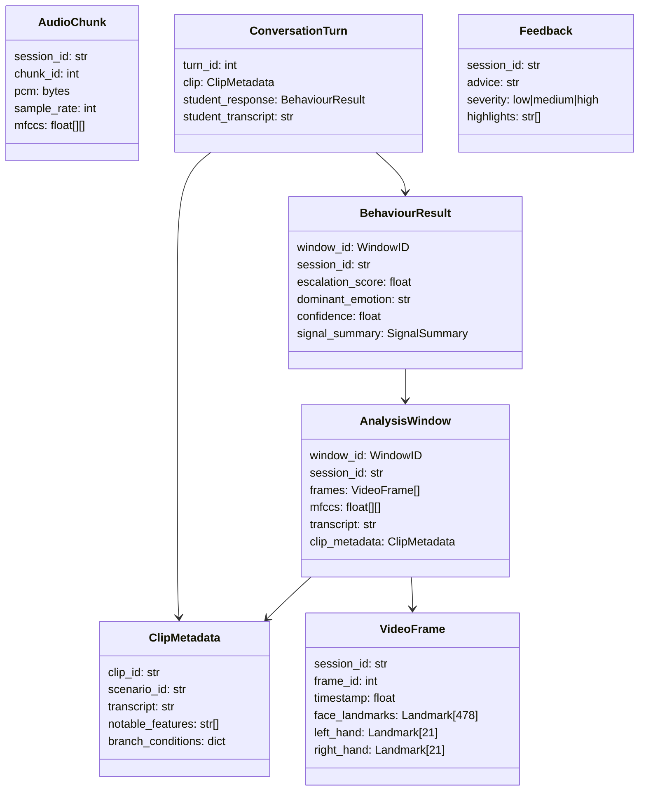
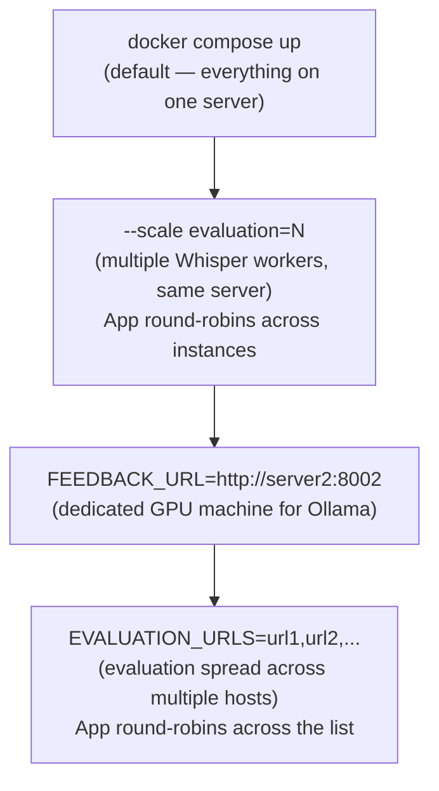

# AR Training Platform — Architecture Overview

A web-based de-escalation training platform for classroom use. Students respond to video scenarios while the system analyses their behaviour in real time and provides coaching feedback at the end of each session.

---

## System Architecture

---

## Data Flow

Each session follows this sequence:

1. **Capture** — The browser extracts face/hand landmarks (MediaPipe.js) and audio features (Meyda.js) from the webcam/microphone. Raw PCM and pre-computed MFCCs are sent to the App container over WebSocket, stamped with a `session_id`.

2. **Coordinate** — The Coordinator assembles incoming frames, MFCCs, and transcripts into ~2s `AnalysisWindows`, each tagged with a `WindowID (session_id:sequence)` so async results can always be matched back to the correct session.

3. **Evaluate** — The Evaluation container runs two things in parallel: Whisper transcribes the raw PCM audio, and the multimodal classifier analyses the full window (landmarks + MFCCs + transcript + clip context) to produce an `escalation_score`.

4. **Branch** — The `escalation_score` is returned to the client immediately via a `SessionUpdate`. The Response Handler switches the scenario video branch if the score crosses a threshold.

5. **Debrief** — At session end, the full `ConversationHistory` (what each video clip showed + how the student responded) is sent to the Feedback container. The LLM generates a structured debrief which streams back to the client.

---

## Key Data Types

---

## Language Choices

| Container  | Language          | Reason                                                    |
|------------|-------------------|-----------------------------------------------------------|
| Client     | TypeScript        | Frontend                                                  |
| App        | TypeScript / Node | I/O heavy, WebSocket native, shares types with frontend   |
| Evaluation | Python            | faster-whisper and classifier require Python ML ecosystem |
| Feedback   | TypeScript / Node | Pure I/O — formats prompt, streams Ollama response        |
| Ollama     | —                 | Existing Docker image                                     |

Python is used exclusively where the ML ecosystem requires it. All other containers use TypeScript/Node for better WebSocket concurrency and consistency with the frontend.

---

## Interfaces

All AI components are interface-driven. Implementations can be swapped without changing any other part of the system.

| Interface                    | Container  | Language   | Responsibility                            |
|------------------------------|------------|------------|-------------------------------------------|
| `TransportInterface`         | Client     | TypeScript | Abstracts WebSocket/WebRTC/HTTP transport |
| `ResponseHandlerInterface`   | Client     | TypeScript | Reacts to escalation scores and feedback  |
| `SessionManagerInterface`    | App        | TypeScript | Session lifecycle, capacity, queue        |
| `CoordinatorInterface`       | App        | TypeScript | Assembles streams into AnalysisWindows    |
| `TranscriptionInterface`     | Evaluation | Python     | Whisper pool, per-session VAD buffers     |
| `BehaviourAnalyserInterface` | Evaluation | Python     | Multimodal escalation classifier          |
| `FeedbackGeneratorInterface` | Feedback   | TypeScript | LLM debrief generation                    |

---

## Deployment

Designed for single-server classroom deployment with optional scaling for larger institutions.

The App container routes requests to AI services directly using URLs read from environment variables. There is no proxy container — adding or moving AI service instances is a one-line `.env` change, and no application code needs to be touched.

| Scenario                | How                                                                        |
|-------------------------|----------------------------------------------------------------------------|
| Single server           | `docker compose up` — no config changes needed                             |
| Scale evaluation        | `docker compose up --scale evaluation=N` — App detects instances via DNS   |
| Offload feedback/Ollama | Set `FEEDBACK_URL` in `.env` to point at a second server                   |
| Multi-host evaluation   | Set `EVALUATION_URLS` in `.env` to a comma-separated list of host URLs     |

All routing configuration lives in `.env`. IT departments never need to touch application code to scale.

### TLS in multi-server deployments

When AI services run on separate machines, connections cross the public internet and must be encrypted. TLS termination should be handled at the infrastructure layer on each remote machine (e.g. Caddy or the institution's existing reverse proxy) rather than inside the containers. The App container then points `EVALUATION_URLS` / `FEEDBACK_URL` at `https://` addresses. No certificate management is required inside this stack.