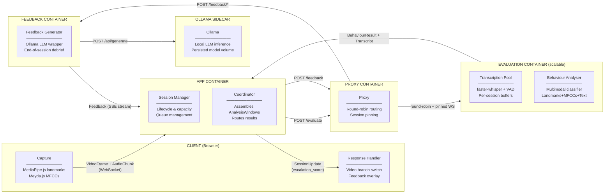
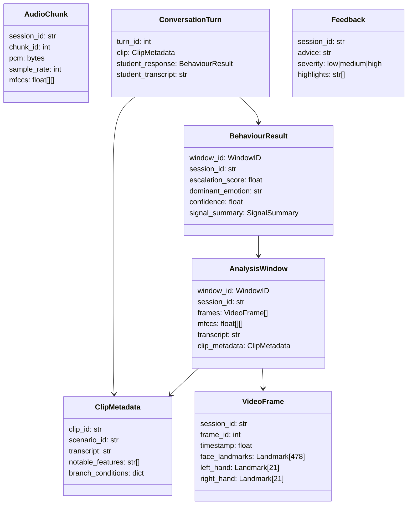
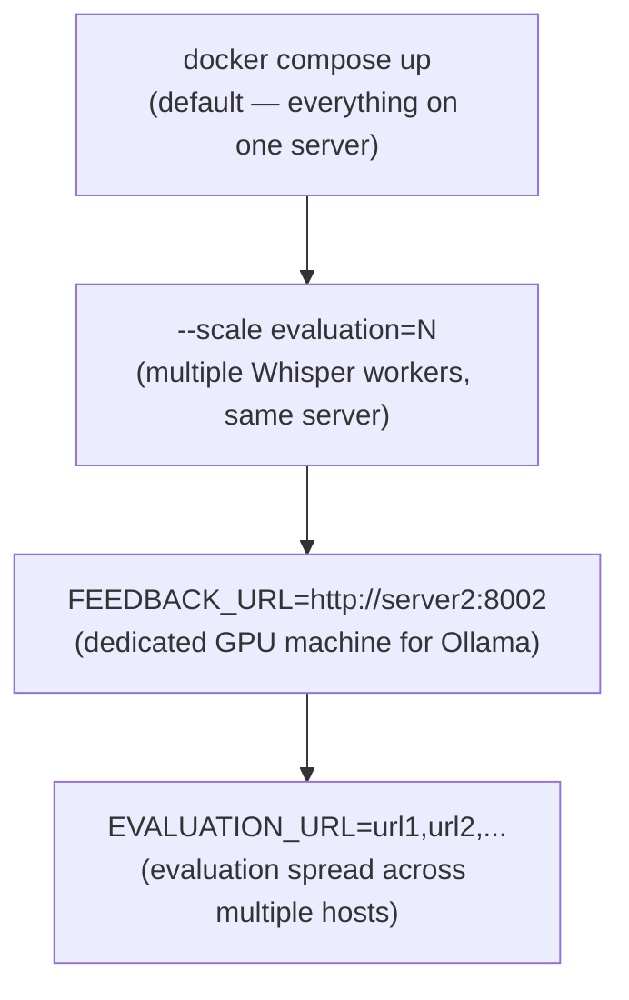

# AR Training Platform — Architecture Overview

A web-based de-escalation training platform for classroom use. Students respond to video scenarios while the system analyses their behaviour in real time and provides coaching feedback at the end of each session.

---

## System Architecture

---

## Data Flow

Each session follows this sequence:

1. **Capture** — The browser extracts face/hand landmarks (MediaPipe.js) and audio features (Meyda.js) from the webcam/microphone. Raw PCM and pre-computed MFCCs are sent to the App container over WebSocket, stamped with a `session_id`.

2. **Coordinate** — The Coordinator assembles incoming frames, MFCCs, and transcripts into \~2s `AnalysisWindows`, each tagged with a `WindowID (session_id:sequence)` so async results can always be matched back to the correct session.

3. **Evaluate** — The Evaluation container runs two things in parallel: Whisper transcribes the raw PCM audio, and the multimodal classifier analyses the full window (landmarks + MFCCs + transcript + clip context) to produce an `escalation_score`.

4. **Branch** — The `escalation_score` is returned to the client immediately via a `SessionUpdate`. The Response Handler switches the scenario video branch if the score crosses a threshold.

5. **Debrief** — At session end, the full `ConversationHistory` (what each video clip showed + how the student responded) is sent to the Feedback container. The LLM generates a structured debrief which streams back to the client.

---

## Key Data Types

---

## Interfaces

All AI components are interface-driven. Implementations can be swapped without changing any other part of the system.

| Interface                    | Container  | Responsibility                            |
|------------------------------|------------|-------------------------------------------|
| `TransportInterface`         | Client     | Abstracts WebSocket/WebRTC/HTTP transport |
| `ResponseHandlerInterface`   | Client     | Reacts to escalation scores and feedback  |
| `SessionManagerInterface`    | App        | Session lifecycle, capacity, queue        |
| `CoordinatorInterface`       | App        | Assembles streams into AnalysisWindows    |
| `TranscriptionInterface`     | Evaluation | Whisper pool, per-session VAD buffers     |
| `BehaviourAnalyserInterface` | Evaluation | Multimodal escalation classifier          |
| `FeedbackGeneratorInterface` | Feedback   | LLM debrief generation                    |

---

## Deployment

Designed for single-server classroom deployment with optional scaling for larger institutions.

| Scenario                | How                                               |
|-------------------------|---------------------------------------------------|
| Single server           | `docker compose up` — no config changes needed    |
| Scale evaluation        | `docker compose up --scale evaluation=N`          |
| Offload feedback/Ollama | Set `FEEDBACK_URL` in `.env` to a second server   |
| Multi-host evaluation   | Set `EVALUATION_URL` to comma-separated host list |

All configuration lives in `.env`. IT departments never need to touch application code to scale.
