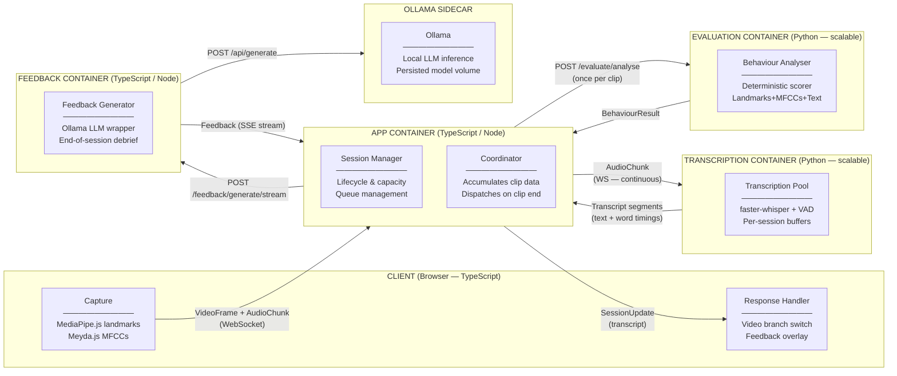
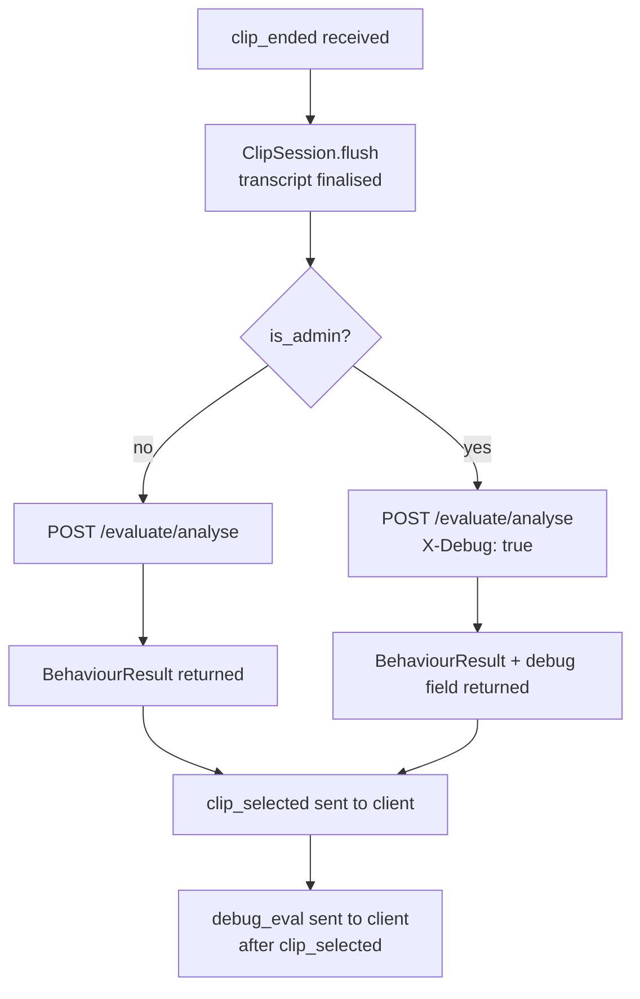
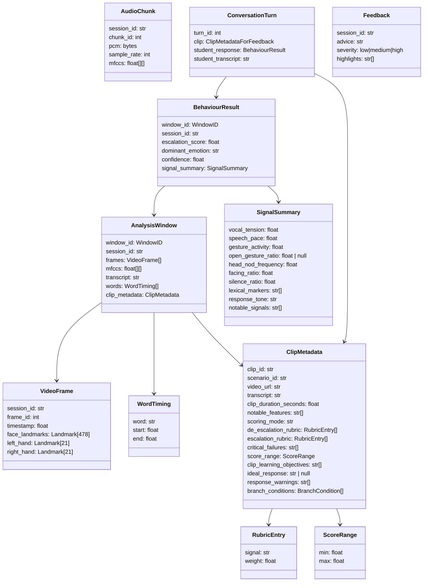
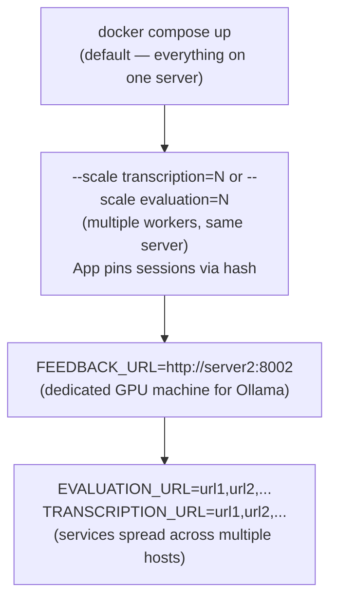

# AR Training Platform — Architecture Overview

A web-based de-escalation training platform for classroom use. Students respond to video scenarios while the system analyses their behaviour and provides coaching feedback at the end of each session.

---

## System Architecture

---

## Data Flow

Each session follows this sequence:

1. **Capture** — The browser extracts face/hand landmarks (MediaPipe.js) and audio features (Meyda.js) from the webcam/microphone. Raw PCM, pre-computed MFCCs, and landmark frames are sent to the App container over WebSocket.

2. **Accumulate** — The Coordinator creates a `ClipSession` for each clip. Incoming frames are buffered inside it; audio chunks are forwarded immediately to the Transcription container over the `ClipSession`'s WebSocket connection. The Transcription container streams partial and final transcript segments back through the same connection, each carrying the recognised text and session-level word timings. The `ClipSession` accumulates both the transcript text and the word timings across all received messages.

3. **Evaluate** — When the client sends `ClipEnded`, the Coordinator calls `flush()` on the `ClipSession`, signalling the Transcription container to emit its final transcript segment. Once that segment arrives, the `ClipSession` resolves with a complete `AnalysisWindow` — all frames, all MFCCs, the full transcript text, and the accumulated word timings — which the Coordinator dispatches to the Evaluation container. The Evaluation container runs the analysis pipeline (see below) and returns a `BehaviourResult`.

4. **Branch** — The `escalation_score` from the returned `BehaviourResult` is used to resolve the next clip from the scenario's branch conditions. The App sends a `ClipSelected` message to the client identifying the next clip.

5. **Debrief** — At session end, the full `ConversationHistory` (what each video clip showed and how the student responded) is sent to the Feedback container via `POST /feedback/generate/stream`. The Feedback container calls Ollama and returns an SSE stream. The App container reads that stream and forwards each token to the client as a `feedback_token` WebSocket message. When the SSE stream ends with a `complete` event, the App sends a final `session_complete` WebSocket message containing the assembled `Feedback` object.

### Debug data path

For **admin sessions only**, the App container adds `X-Debug: true` to each
`POST /evaluate/analyse` request. The Evaluation container assembles intermediate
pipeline data and returns it in a `debug` field alongside the normal
`BehaviourResult`. After sending `clip_selected` to the client, the App sends a
`debug_eval` WebSocket message containing the full result, the per-stage
intermediates, and App-level capture statistics (frame count, audio chunk count,
word timing count, evaluation latency). Non-admin sessions are entirely
unaffected — no header is added, no debug field is assembled, and no extra
message is sent.

The debug path has no effect on the timing of `clip_selected` — it uses the same
evaluation call and result. The `debug_eval` message is sent as a follow-on after
`clip_selected` is already dispatched.

---

## Evaluation Pipeline

The Evaluation container receives a single `AnalysisWindow` per clip and produces a single `BehaviourResult`. The pipeline has no custom trained classifier. Instead, three signal-extraction stages produce a set of named, interpretable signals; a deterministic weighted scorer then maps those signals to an `escalation_score` using the rubric embedded in the clip's metadata.

This design was chosen over a trained classifier because: labelled training data does not yet exist; the rubric fields in the scenario metadata encode the domain knowledge that a classifier would need to learn; and a deterministic scorer is auditable and explainable to educators. The interface is identical to what a trained classifier would implement — if labelled data is collected in future, the scorer can be replaced without changing any other part of the system.

The two pre-trained models used (audio emotion classifier in Stage A; sentiment classifier in Stage C) are lightweight, general-purpose models that do not require project-specific training data.

Stages A, B, and C run independently and can be parallelised; the Scorer stage depends on all three.

---

### Stage A — Audio Emotion Extraction

**Input:** `mfccs` from the `AnalysisWindow`

**Process:** A pre-trained multilingual audio emotion classifier applied to the MFCC matrix produces a per-clip emotion label and continuous arousal and valence scalars. The arousal scalar, combined with MFCC energy variance across the clip, is used to compute `vocal_tension`.

**Outputs:** `audio_emotion` (label), `arousal` (float 0–1), `valence` (float −1–1)

**Feeds:** `dominant_emotion`, `vocal_tension`

---

### Stage B — Landmark Feature Extraction

**Input:** `frames` (array of `VideoFrame`) from the `AnalysisWindow`

**Process:** Per-frame values derived from the landmark arrays:

- **Wrist and fingertip displacement vectors** — position difference between consecutive frames for each detected hand landmark. Used to compute `gesture_activity` (variance across the clip).
- **Hand configuration classification** — whether each detected hand shows an open-palm or closed/pointing configuration, based on the angular geometry of finger landmarks. Used to compute `open_gesture_ratio`.
- **Head landmark Y-coordinates** — vertical position of nose tip and forehead landmarks across frames. Smoothed with a rolling window; the peak frequency of vertical oscillation is extracted as `head_nod_frequency`.
- **Face mesh lateral symmetry** — the horizontal spread between equivalent left/right face contour landmarks (e.g. cheekbone and ear-region landmarks) across frames. When the student faces the camera, left and right landmarks are approximately symmetric; when turned away, one side collapses. The fraction of frames where the face is estimated to be forward-facing is extracted as `facing_ratio`. Note: the client capture pipeline uses MediaPipe face mesh (478 face-only landmarks) and does not include body pose or shoulder landmarks. `facing_ratio` is therefore a face-mesh-based estimate, not a shoulder-detection measurement.
- **Hand detection presence flag** — whether at least one hand landmark array is non-empty in each frame. The ratio of hand-detected frames across the clip determines whether `open_gesture_ratio` can be computed reliably.

**Outputs:** per-frame landmark feature vectors, `hands_detected_ratio` (float 0–1)

**Feeds:** `gesture_activity`, `open_gesture_ratio`, `head_nod_frequency`, `facing_ratio`

---

### Stage C — Transcript Feature Extraction

**Input:** `transcript` (plain text) and `words` (session-level word timings) from the `AnalysisWindow`

**Process:**

- **Silence ratio** — total clip duration (from `clip_metadata.clip_duration_seconds`) minus cumulative speech duration derived from word timing boundaries, divided by clip duration. When `words` is empty (stub pool or no speech detected), falls back to `0.0` if the transcript is non-empty or `1.0` if it is empty.
- **Speech pace** — syllable count estimated from word tokens divided by cumulative speech duration from word timings, expressed as syllables per second of actual speech. When `words` is empty, falls back to syllable count divided by `clip_duration_seconds`.
- **Lexical de-escalation markers** — pattern matching against a fixed vocabulary of Dutch empathy acknowledgements (e.g. "ik begrijp", "dat klinkt moeilijk", "ik hoor je"), validation phrases, and open-question structures. Output is a list of matched marker strings.
- **Response tone** — a three-class (positive/neutral/negative) classification of the student's full transcript using a lightweight pre-trained Dutch or multilingual sentiment classifier. Captures defensive, dismissive, or hostile phrasing that does not match specific marker patterns.

**Outputs:** `silence_ratio` (float), `speech_pace` (float), `lexical_markers` (list of strings), `response_tone` (positive/neutral/negative)

**Feeds:** `silence_ratio`, `speech_pace`, `lexical_markers`, `response_tone`

---

### Scorer Stage

**Inputs:** outputs of Stages A, B, and C; `clip_metadata` from the `AnalysisWindow`

**Process:** The scorer maps each computed signal to zero or more rubric signal names from the controlled vocabulary (e.g. `vocal_tension` above a configured threshold → `raised_voice` detected; `lexical_markers` non-empty → `empathy_phrase` detected). It then applies the clip's rubric:

1. In `"rubric"` mode: compute a weighted sum of detected positive signals (from `de_escalation_rubric`) minus a weighted sum of detected negative signals (from `escalation_rubric`). Normalise by the sum of all weights to produce a score in the range −1.0 to 1.0. Apply any `critical_failures` penalty. Clamp the result to `score_range`.

2. In `"threshold"` mode: only evaluate whether detected negative signals exceed a configurable threshold. Absence of positive signals is not penalised. Clamp the result to `score_range`.

`confidence` reflects the proportion of rubric signals for which a reliable measurement was available (e.g. if hands were not detected for the majority of the clip, any hand-based rubric signals reduce confidence).

**Outputs:** `escalation_score` (float −1.0 to 1.0), `confidence` (float 0.0 to 1.0)

---

## Key Data Types

---

## Language Choices

| Container     | Language          | Reason                                                                        |
|---------------|-------------------|-------------------------------------------------------------------------------|
| Client        | TypeScript        | Frontend                                                                      |
| App           | TypeScript / Node | I/O heavy, WebSocket native, shares types with frontend                       |
| Transcription | Python            | faster-whisper requires the Python ML ecosystem                               |
| Evaluation    | Python            | Audio emotion and sentiment classifiers require the Python ML ecosystem       |
| Feedback      | TypeScript / Node | Pure I/O — formats prompt, streams Ollama response                            |
| Ollama        | —                 | Existing Docker image                                                         |

Python is used exclusively where the ML ecosystem requires it. The Evaluation container retains Python because it runs two pre-trained model inference calls (audio emotion classifier in Stage A; sentiment classifier in Stage C) that depend on the Python ML ecosystem (transformers, librosa, or similar). All other containers use TypeScript/Node for better WebSocket concurrency and consistency with the frontend.

---

## Interfaces

All AI components are interface-driven. Implementations can be swapped without changing any other part of the system.

| Interface                    | Container     | Language   | Responsibility                             |
|------------------------------|---------------|------------|--------------------------------------------|
| `TransportInterface`         | Client        | TypeScript | Abstracts WebSocket/WebRTC/HTTP transport  |
| `ResponseHandlerInterface`   | Client        | TypeScript | Reacts to transcript updates and feedback  |
| `SessionManagerInterface`    | App           | TypeScript | Session lifecycle, capacity, queue         |
| `CoordinatorInterface`       | App           | TypeScript | Accumulates clip data, dispatches windows  |
| `TranscriptionInterface`     | Transcription | Python     | Whisper pool, per-session VAD buffers      |
| `BehaviourAnalyserInterface` | Evaluation    | Python     | Signal extraction and deterministic scorer |
| `FeedbackGeneratorInterface` | Feedback      | TypeScript | LLM debrief generation                     |

---

## Deployment

Designed for single-server classroom deployment with optional scaling for larger institutions.

The App container routes requests to AI services directly using URLs read from environment variables. There is no proxy container — adding or moving AI service instances is a one-line `.env` change, and no application code needs to be touched.

| Scenario                   | How                                                                                       |
|----------------------------|-------------------------------------------------------------------------------------------|
| Single server              | `docker compose up` — no config changes needed                                            |
| Scale transcription        | `docker compose up --scale transcription=N` — App pins sessions via hash                  |
| Scale evaluation           | `docker compose up --scale evaluation=N` — App pins sessions via hash                     |
| Offload feedback/Ollama    | Set `FEEDBACK_URL` in `.env` to point at a second server                                  |
| Multi-host AI services     | Set `EVALUATION_URL` and/or `TRANSCRIPTION_URL` to comma-separated lists of host URLs     |

All routing configuration lives in `.env`. IT departments never need to touch application code to scale.

### TLS in multi-server deployments

When AI services run on separate machines, connections cross the public internet and must be encrypted. TLS termination should be handled at the infrastructure layer on each remote machine (e.g. Caddy or the institution's existing reverse proxy) rather than inside the containers. The App container then points its service URLs at `https://` addresses. No certificate management is required inside this stack.