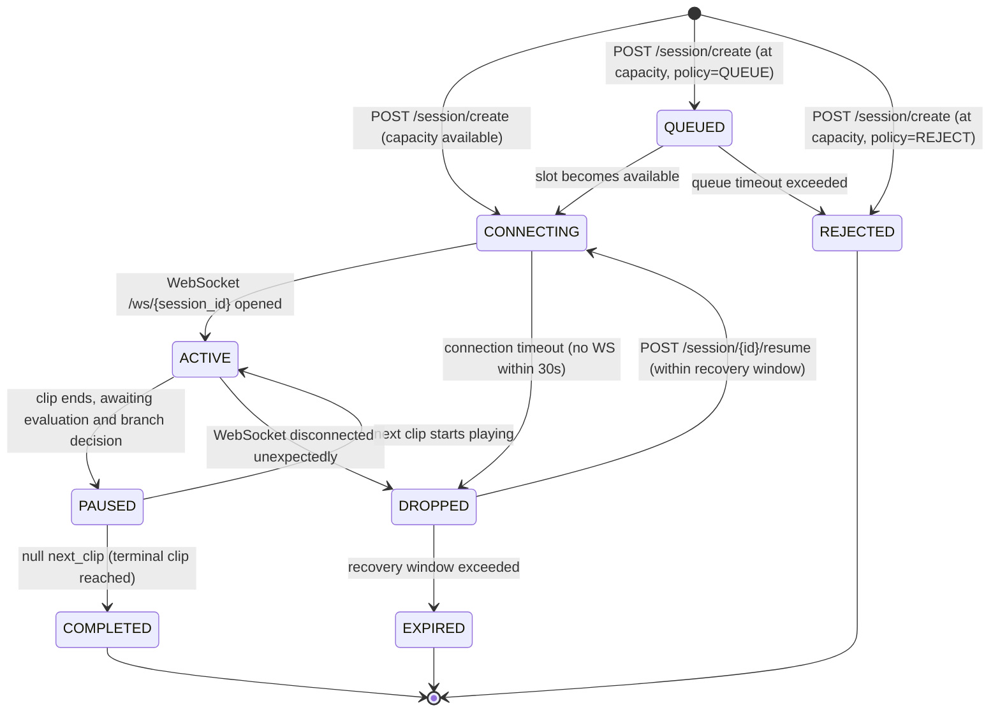

# Session Lifecycle

Describes every valid state a session can be in, what triggers each transition, and what each container is responsible for during that state.

---

## State Machine



---

## State Descriptions

### `CONNECTING`
Session has been created and a slot is reserved. Waiting for the client to open the WebSocket connection. If no connection is established within `session_timeout_s` (default 30s), the session transitions to `DROPPED` and the slot is released.

**App container responsibilities:**
- Reserve capacity slot
- Initialise `SessionContext` with empty `conversation_history`
- Start connection timeout timer

---

### `QUEUED`
At-capacity session is held in a waiting room. The client receives periodic `SessionUpdate` messages with `queue_position` set. When a slot becomes available, the session moves to `CONNECTING` and the client is notified to open the WebSocket.

**App container responsibilities:**
- Maintain ordered queue
- Send `queue_position` updates to client as other sessions complete
- Enforce maximum queue size — reject new sessions if queue is full

---

### `ACTIVE`
WebSocket is open. Frames and audio chunks are flowing. The Coordinator routes incoming data into the current `ClipSession`, which simultaneously forwards audio to the Transcription container and buffers frames and MFCCs for the clip. `SessionUpdate` messages containing the accumulated transcript are sent to the client whenever a transcript segment arrives.

**App container responsibilities:**
- Forward `VideoFrame` messages to the Coordinator (`ClipSession` buffers them)
- Forward `AudioChunk` messages to the Coordinator (`ClipSession` forwards them to the Transcription container and buffers the MFCCs)
- Send `SessionUpdate` to the client on each received transcript segment

**Transcription container responsibilities:**
- Maintain a per-connection PCM accumulation buffer for the clip
- Dispatch rolling transcription windows as audio accumulates, emitting partial `Transcript` messages
- On `POST /transcription/finalise/{session_id}`, transcribe any remaining buffered audio and emit a final `Transcript` message (`is_final: true`)

---

### `PAUSED`
A clip has finished playing. The App container finalises the transcript, dispatches the complete clip window to Evaluation, and waits for the result. This state is brief — it exists to ensure all data is committed cleanly before the next clip begins.

**App container responsibilities:**
- Call `ClipSession.flush()`, which fires `POST /transcription/finalise/{session_id}` and awaits the `is_final: true` Transcript over the WebSocket
- Once the final transcript arrives, the `ClipSession` resolves with a complete `AnalysisWindow` — all frames, MFCCs, and the full accumulated transcript
- Dispatch that `AnalysisWindow` to the Evaluation container
- Read the `escalation_score` from the returned `BehaviourResult`
- Determine `next_clip` from `ClipMetadata.branch_conditions` using that score
- Append the completed `ConversationTurn` to the session via `SessionManager.appendTurn()`
- Call `POST /transcription/reset/{session_id}` and `POST /evaluate/reset/{session_id}` to clear buffers
- Send `ClipReady` to the client with the resolved `next_clip_id` and `clip_score`

---

### `COMPLETED`
A terminal clip (`next_clip: null`) has been reached and all turns have been committed. The App container compiles the full `FeedbackRequest` from `conversation_history` and sends it to the Feedback container. Feedback is delivered to the client over the still-open WebSocket as `FeedbackToken` messages followed by a final `SessionComplete`.

**App container responsibilities:**
- Compile `FeedbackRequest` from `SessionContext.conversation_history`
- Send to Feedback container via streaming endpoint (`POST /feedback/generate/stream`)
- Forward SSE tokens to the client as `FeedbackToken` WebSocket messages
- Send final `SessionComplete` message when generation finishes
- Release capacity slot
- Close WebSocket cleanly

**Feedback container responsibilities:**
- Generate debrief from full `ConversationTurn` history
- Stream tokens back to App container via SSE

---

### `DROPPED`
WebSocket disconnected unexpectedly. The session and its `conversation_history` are preserved in memory for `recovery_window_s` (default 30s). The capacity slot remains reserved during this window.

If the client reconnects via `POST /session/{id}/resume` within the recovery window, the session transitions back to `CONNECTING` and the client receives the current `SessionContext` to restore state.

If the recovery window expires, the session transitions to `EXPIRED` and the slot is released.

---

### `EXPIRED`
Recovery window has passed without reconnection. All session state is discarded and the capacity slot is released. The session cannot be resumed. The client must create a new session.

---

### `REJECTED`
Returned synchronously from `POST /session/create` when at capacity and `CapacityPolicy` is `REJECT`. No session is created and no slot is reserved. The client should display an appropriate message and allow the user to retry.

---

## Clip Score Calculation

The `escalation_score` used for branching at the end of each clip is the `escalation_score` from the single `BehaviourResult` returned by the Evaluation container for that clip.

The Evaluation container receives a complete `AnalysisWindow` covering the student's entire response — all frames, all MFCCs, and the full transcript — and produces one result that reflects the student's overall behaviour across the whole clip.

```
clip_score = BehaviourResult.escalation_score
```

The first matching `branch_condition` where `min_score ≤ clip_score < max_score` determines `next_clip`.

---

## Timing Constraints

| Event                            | Constraint                                                 |
|----------------------------------|------------------------------------------------------------|
| WebSocket must open after create | Within `session_timeout_s` (default 30s)                   |
| Reconnect after drop             | Within `recovery_window_s` (default 30s)                   |
| Queue position update interval   | Every 5–10s (client-side polling of `/session/{id}/queue`) |
| Flush on clip end                | Immediately when client signals clip complete              |
| ClipSession resolve timeout      | 5s — if final transcript not received, clip proceeds without evaluation result |