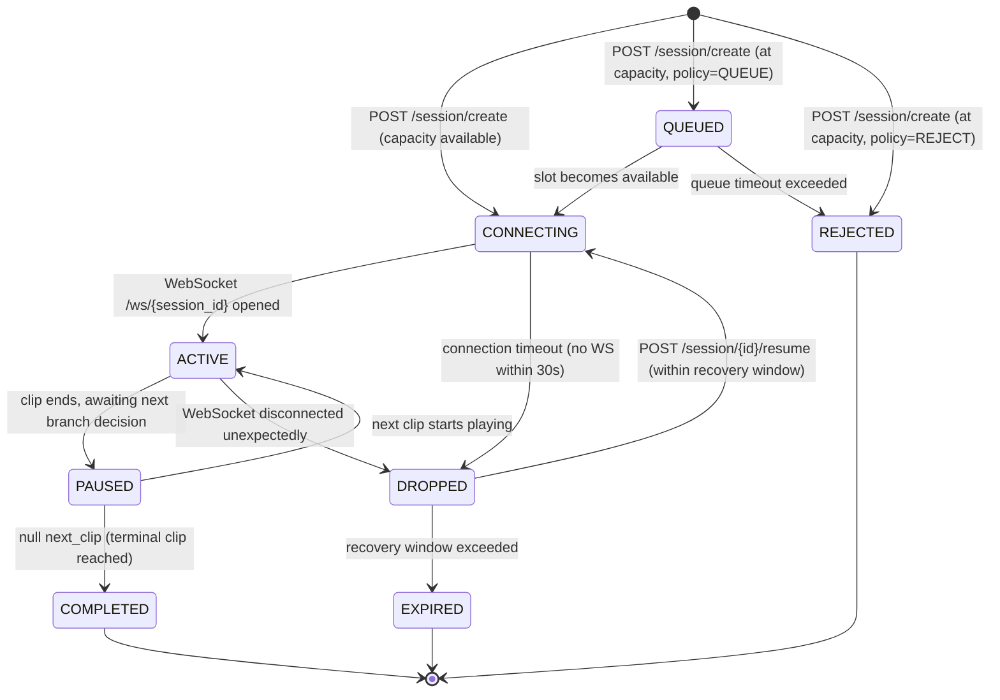

# Session Lifecycle

Describes every valid state a session can be in, what triggers each transition, and what each container is responsible for during that state.

---

## State Machine



---

## State Descriptions

### `CONNECTING`
Session has been created and a slot is reserved. Waiting for the client to open the WebSocket connection. If no connection is established within `session_timeout_s` (default 30s), the session transitions to `DROPPED` and the slot is released.

**App container responsibilities:**
- Reserve capacity slot
- Initialise `SessionContext` with `window_sequence = 0` and empty `conversation_history`
- Start connection timeout timer

---

### `QUEUED`
At-capacity session is held in a waiting room. The client receives periodic `SessionUpdate` messages with `queue_position` set. When a slot becomes available, the session moves to `CONNECTING` and the client is notified to open the WebSocket.

**App container responsibilities:**
- Maintain ordered queue
- Send `queue_position` updates to client as other sessions complete
- Enforce maximum queue size — reject new sessions if queue is full

---

### `ACTIVE`
WebSocket is open. Frames and audio chunks are flowing. The Coordinator is assembling `AnalysisWindows` and dispatching them to the Evaluation container. `SessionUpdate` messages with `escalation_score` are being sent to the client.

**App container responsibilities:**
- Forward `VideoFrame` and `AudioChunk` messages to the Coordinator
- Forward `BehaviourResult` and `Transcript` messages from Evaluation back through the session
- Send `SessionUpdate` to the client on every result
- Track `window_sequence` — increment after each dispatched window

**Evaluation container responsibilities:**
- Maintain per-session audio buffer and VAD state
- Run Whisper transcription and multimodal classifier in parallel

---

### `PAUSED`
A clip has finished playing. The client has received the final `escalation_score` for the clip and is determining which branch to take. During this state the Coordinator calls `flush_session()` to dispatch any partially-assembled window, and `reset_session()` is called on the Transcription pool to clear the audio buffer before the next clip.

This state is brief — it exists to ensure the audio buffer is clean before the next clip starts and to give the Coordinator time to commit the `ConversationTurn`.

**App container responsibilities:**
- Call `flush_session()` on the Coordinator
- Call `reset_session()` on the Evaluation container
- Append the completed `ConversationTurn` to the session via `SessionManager.append_turn()`
- Determine `next_clip` from `ClipMetadata.branch_conditions` using the clip's average `escalation_score`
- Send next clip instruction to client

---

### `COMPLETED`
A terminal clip (`next_clip: null`) has been reached and all turns have been committed. The App container compiles the full `FeedbackRequest` from `conversation_history` and sends it to the Feedback container. Feedback is delivered to the client over the still-open WebSocket as a `session_complete` message (with streaming tokens if using SSE).

**App container responsibilities:**
- Compile `FeedbackRequest` from `SessionContext.conversation_history`
- Send to Feedback container (streaming preferred)
- Forward tokens to client as `feedback_token` messages
- Send final `session_complete` message when generation finishes
- Release capacity slot
- Close WebSocket cleanly

**Feedback container responsibilities:**
- Generate debrief from full `ConversationTurn` history
- Stream tokens back to App container

---

### `DROPPED`
WebSocket disconnected unexpectedly. The session and its `conversation_history` are preserved in memory for `recovery_window_s` (default 30s). The capacity slot remains reserved during this window.

If the client reconnects via `POST /session/{id}/resume` within the recovery window, the session transitions back to `CONNECTING` and the client receives the current `SessionContext` to restore state.

If the recovery window expires, the session transitions to `EXPIRED` and the slot is released.

---

### `EXPIRED`
Recovery window has passed without reconnection. All session state is discarded and the capacity slot is released. The session cannot be resumed. The client must create a new session.

---

### `REJECTED`
Returned synchronously from `POST /session/create` when at capacity and `CapacityPolicy` is `REJECT`. No session is created and no slot is reserved. The client should display an appropriate message and allow the user to retry.

---

## Clip Average Score Calculation

The `escalation_score` used for branching at the end of each clip is the **mean** of all `BehaviourResult.escalation_score` values collected during that clip (i.e. across all windows while the clip was playing).

This smooths out momentary spikes and gives a more representative picture of the student's overall response to the clip.

```
clip_score = mean(window_scores collected between clip_start and clip_end)
```

The first matching `branch_condition` where `min_score ≤ clip_score < max_score` determines `next_clip`.

---

## Timing Constraints

| Event                            | Constraint                                                 |
|----------------------------------|------------------------------------------------------------|
| WebSocket must open after create | Within `session_timeout_s` (default 30s)                   |
| Reconnect after drop             | Within `recovery_window_s` (default 30s)                   |
| Queue position update interval   | Every 5–10s (client-side polling of `/session/{id}/queue`) |
| Analysis window duration         | ~2s of captured frames + 0.5s overlap                      |
| Flush on clip end                | Immediately when client signals clip complete              |
